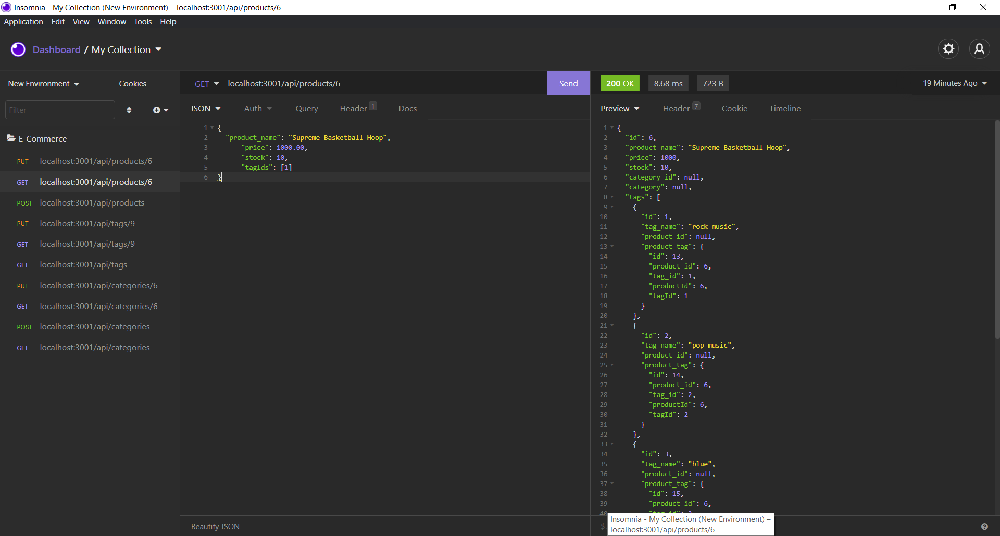

# E-Commerce-Back-End

    
### [Description](#description)
    
For this project I was given the task to build the back end for an e-commerce site by modifying starter code and configure a working Express.js API to use Sequelize to interact with a MySQL database.
    
### [Motivation](#Motivation)

The motivation behind this project comes from e-commerce being the largest sector of the electronics industry, and the need for me as a developer to understand the fundamental architecture of platforms like Shopify and WooCommerce who provide a suite of services to businesses of all sizes.
     
### [Problems Solved](#Motivation)
One of the most problematic issues I encountered involved finding the correct syntax to perform the POST and PUT Methods. The  sequelize documentation was very useful in providing the information that I needed to implement the features of this application.
    
### [What I learned](#Motivation)
From completing this assignment I have learned how to use MySQL Databases, Sequelize, and Express together to send data to and from a client application and server database that implements Object Relational Mapping of the data it stores.
    
## [Table of Contents](#table-of-contents)
 
    
1. [Installation](#installation)
    
1. [Usage](#usage)
    
1. [Demo](#demo)
    
1. [Test](#test)
    
1. [Badges](#badges)
    
1. [Features](#features)
    
1. [Contributors](#contributors)
    
1. [Contribute](#contribute)
    
1. [Questions](#questions)
    
1. [License](#license)

    
## [Installation](#installation)
    
To install this application use the link the link to Github repository located in one of the following sections
    
## [Usage](#usage)
    
To use this application 
    
## [Walkthrough Video](https://watch.screencastify.com/v/GGwCSXMdfz8yFtvbkKCa) <-link
    
### [Demo Screenshot 1](#demo-screenshot-1)
    

    
## [Test](#test)
    
This application itself is the testing of the routes and functioins that manipulates the data in the database.
    
## [Badges](#badges)
    

    
You can get badges hosted by [shields.io](https://shields.io/). 
    
## [Features](#features)
    
If your project has a lot of features, list them here.
    
## [Contributors](#contributors)
    
Landon Hinkle
    
## [Contribute](#contribute)
    

    
If you created an application or package and would like other developers to contribute it, you can include guidelines for how to do so. The [Contributor Covenant](https://www.contributor-covenant.org/) is an industry standard, but you can always write your own if you'd prefer.
    
## [Questions](#questions)
    
Email me at llh9@yahoo.com
### Walkthrough Video link
[https://watch.screencastify.com/v/GGwCSXMdfz8yFtvbkKCa ](https://watch.screencastify.com/v/GGwCSXMdfz8yFtvbkKCa) 

### Repository link
[https://github.com/llh9/E-Commerce-Back-End](https://github.com/llh9/E-Commerce-Back-End)
    
## [License](#license)
    
ISC
    